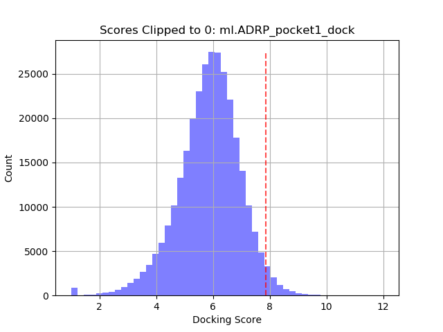
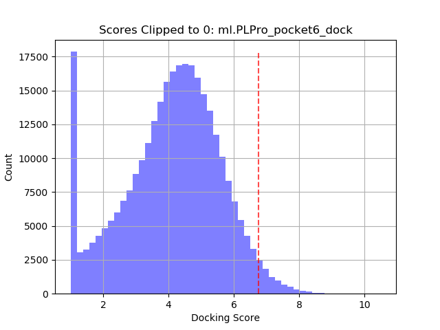

This pipeline generates ML dataframes for predicting docking scores from molecular features.<br>
In this version, as opposed to branch `raw_data`, the docking scores are stored in ./data/raw/docking/**/<target_name>*.csv

## Getting started
Clone the repo.
```shell
$ git clone https://github.com/2019-ncovgroup/ML-docking-dataframe-generator
```

Inside project dir, create folders that will contain raw docking scores and features.
```shell
$ cd ML-docking-dataframe-generator
$ mkdir -p data/raw/docking
$ mkdir -p data/raw/features/fea-subsets-hpc
```

Get the required data from Box (or Globus):
- Docking scores from `19-nCoV/drug-screening/RELEASES/may29/OZD/<batch_name>*.4col.csv` to `./data/raw/docking/OZD/<batch_name>*.4col.csv`
- Features dataframe generated by `github.com/adpartin/mol-features` to `./data/raw/features/fea-subsets-hpc/OZD/descriptors/dd_fea.parquet`.<br>


## Genearte ML dataframes
The main script `./src/main_gen_dfs_v5dot1.py` takes as input arguments the scores dir (argument `--scores_dir`) and features dir (argument `--fea_dir`). Each scores file which corresponds to a specific target is merged with the features dataframe on a drug ID column (at this point we're using the TITLE).

Since the recent batches of docking scores contain on the order of 6M compounds, we decided to build the ML dataframes using a subset of samples.
The question is how should we sample the scores from the entire set of 6M samples?
We observed that sampling a set of scores which results in a flatten (uniform) distribution provides better prediction accuracy in inference on a subset of high docking samples. Thus, we generate ML dataframe for each target containing 1M samples with an approximately uniform distribution of scores.

The resulting ML data files follow the same naming convention: `DIR.ml.<target_name>.*.<feature_type>.parquet`.
For example, for the target `3CLPro_7BQY_A_1_F.Orderable_zinc_db_enaHLL`, the script will create a dir called 
`./out/V5.1-1M-flatten/DIR.ml.3CLPro_7BQY_A_1_F.Orderable_zinc_db_enaHLL.sorted.4col`

```
$ python src/main_gen_dfs_v5dot1.py --scores_dir ./data/raw/docking/V5.1/OZD --fea_dir ./data/raw/features/fea-subsets-hpc --drg_set OZD --fea_type descriptors --par_jobs 16
```
The `par_jobs` argument uses the `joblib` Python package to parallelize the process https://joblib.readthedocs.io/.

Histograms of docking scores (`reg` column) of two different targets. Higher values indicate better docking.

 

- `reg`: regression score. Raw docking scores are transformed with:
```python
reg = abs(np.clip(df[reg_raw], a_min=None, a_max=0))
```
`reg` are the transformed scores where larger values indicate better docking.
- `cls`: classification score. `cls` was generated by computing the 0.975 quantile (dashed vertical line in a histogram) and using the value to threshold `reg` for binary classification task (values larger that the quantile are labeled with 1).
- `binner`: per-filter classifier. `binner` was generated by theresholding `reg` as follows: 0 if reg_value < 2 else 1 <br>
Certain targets exhibits a large number of non-docking drugs as shown for `PLPro_pocket6` (large count around 0 in the histogram). To facilitate learning of ML predictors (`reg` and `cls`), we can build a binner classifier that serves a pre-filter that aims to filter out those non-docking drugs before building models for `reg` and `cls`.
- `TITLE`: drug name
- `SMILES`: SMILES string
