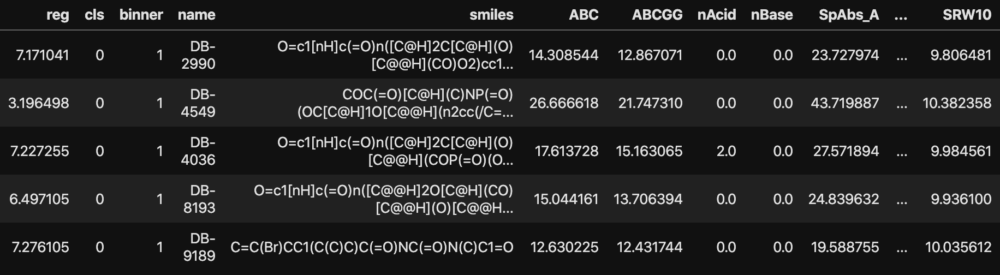
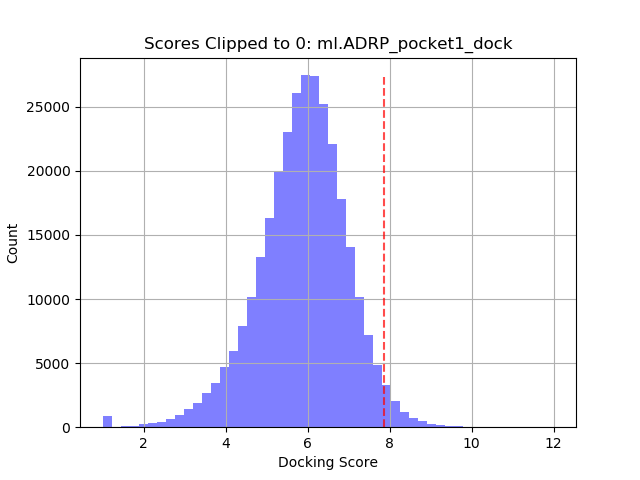
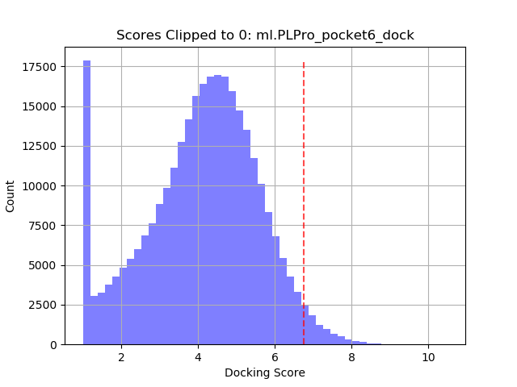
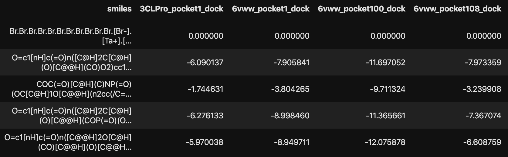
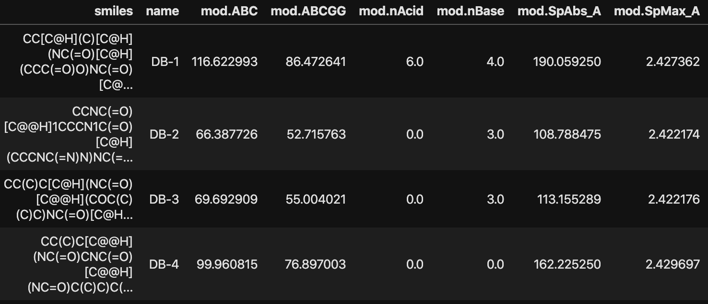

This pipeline generates ML dataframes for predicting docking scores from molecular features.

## Getting started
Clone the repo.
```shell
$ git clone https://github.com/2019-ncovgroup/ML-docking-dataframe-generator
```

Inside project dir, create folder that will contain raw docking scores.
```shell
$ cd ML-docking-dataframe-generator
$ mkdir -p data/raw/raw_data
```

Copy a batch of docking score results from Box or Petrel to `./data/raw/raw_data` (e.g., from Box copy 019-nCoV/drug-screening/raw_data/V3_docking_data_april_9).
<!-- Run script to canoncalize the SMILES. This will dump the original scores with the `smiles` column canonicalized into `./data/processed/V3_docking_data_april_9`. -->
<!-- ```shell
$ python canon_smiles.py --datapath data/raw/raw_data/V3_docking_data_april_9/docking_data_out_v3.1.csv
``` -->

## Genearte ML dataframes
The main script `./src/main_gen_dfs.py` takes docking scores (argument `--scores_path`) and features (argument `--fea_path`) to generate ML dataframes.
The script canonicalizes the `smiles` column (first column) in the docking file and merges with the features (descriptors) on `smiles`. The script then parses the merged dataset to generate an ML dataframe for every receptor/target (columns in the docking file starting from [1:]).
<!-- and every feature type (available in features dataset).<br> -->

The resulting ML data files follow the same naming convention: `ml.<target_name>.<feature_type>.csv`.
For example, assume a target `3CLPro_pocket1_dock`. The script will dump the following files:
- `ml.3CLPro_pocket1_round1_dock.dsc.csv` (scores with Mordred descriptors)
- `ml.3CLPro_pocket1_round1_dock.dsc.scaler.pkl` (standard scaler for descriptors; the desciptors file is not scaled, see note below)
<!-- - `ml.3CLPro_pocket1_round1_dock.ecfp2.csv` (scores with ECFP2 fingerprints) -->
<!-- - `ml.3CLPro_pocket1_round1_dock.ecfp4.csv` (scores with ECFP4 fingerprints) -->
<!-- - `ml.3CLPro_pocket1_round1_dock.ecfp6.csv` (scores with ECFP6 fingerprints) -->

```
$ python src/main_gen_dfs.py --scores_path ./data/raw/raw_data/V3_docking_data_april_9/docking_data_out_v3.1.csv --fea_path ./data/raw/features/BL1/ena+db.smi.desc.parquet --par_jobs 16
```
The `par_jobs` argument uses the `joblib` Python package to parallelize the process https://joblib.readthedocs.io/.

A subset of `ml.ADRP_pocket1_dock.dsc.csv` from March 30th:


Histograms of docking scores (`reg` column) of two different targets. Higher values indicate better docking.

 

- `reg`: regression score. Raw docking scores are transformed with:
```python
reg = abs(np.clip(df[reg_raw], a_min=None, a_max=0))
```
`reg` are the transformed scores where larger values indicate better docking.
- `cls`: classification score. `cls` was generated by computing the 0.975 quantile (dashed vertical line in a histogram) and using the value to threshold `reg` for binary classification task (values larger that the quantile are labeled with 1).
- `binner`: per-filter classifier. `binner` was generated by theresholding `reg` as follows: 0 if reg_value < 2 else 1 <br>
Certain targets exhibits a large number of non-docking drugs as shown for `PLPro_pocket6` (large count around 0 in the histogram). To facilitate learning of ML predictors (`reg` and `cls`), we can build a binner classifier that serves a pre-filter that aims to filter out those non-docking drugs before building models for `reg` and `cls`.
- `name`: drug name
- `smiles`: canonical SMILES string

## Docking Scores
Raw docking scores from HP docking are stored in Box `2019-nCoV/drug-screening/raw_data/`. Every new batch of results is dumped into `2019-nCoV/drug-screening/raw_data/*docking_data_<month>_<day>` (e.g., `2019-nCoV/drug-screening/raw_data/V3_docking_data_april_9`).
Each batch is structured with SMILES strings in the first column and receptors/targets in the subsequent columns. The values are the docking scores. For more info refer to https://github.com/2019-ncovgroup/HTDockingDataInstructions.



## Molecular Features
The construction of molecular feature sets is moved to another repo https://github.com/adpartin/mol-features.<br>
Below is a screenshot of Mordred descriptors. 

<!-- The original Mordred descriptors are stored in Box `2019-nCoV/drug-screening/ena+db.desc.gz`. This file requires some pre-processing (duplicates, bad rows, NaNs, casting). This needs to be done only once. The clean version of the features (Enamine + DrugBank; 300K SMILES) can be found in Box `2019-nCoV/drug-screening/features/ena+db/ena+db.features.parquet`. If you need to generate the descriptors from the original file, follow the steps below. -->

<!-- - Clean and canonicalize smiles `ena+db.smi`. Use `src/ena+db/clean_smiles.py` (updated file is in `2019-nCoV/drug_screening/features/ena+db/ena+db.smi.can.csv`)
- Clean descriptors `ena+db.desc`. Use `src/ena+db/clean_desc.py` (updated file is in `2019-nCoV/drug_screening/features/ena+db/ena+db.desc.parquet`)
- Merge smiles with descriptors and generate fingerprints from smiles (ECFP2, ECFP4, ECFP6). Use `src/ena+db/gen_fea_df.py` (updated file is in `2019-nCoV/drug_screening/features/ena+db/ena+db.features.parquet`) -->


